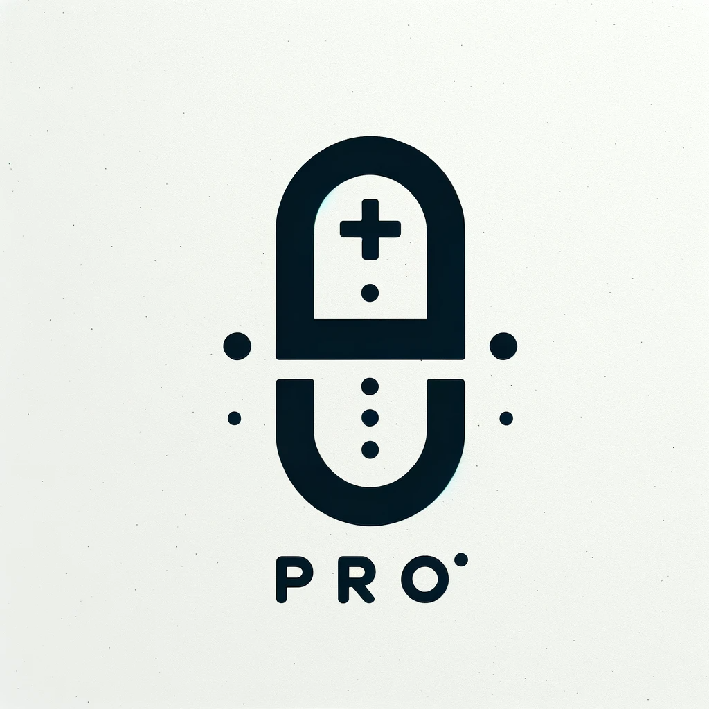
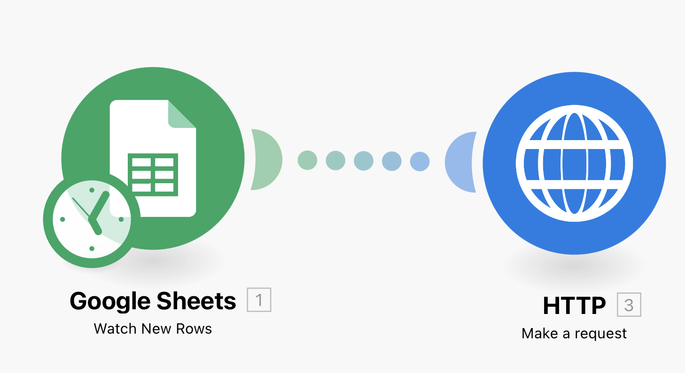
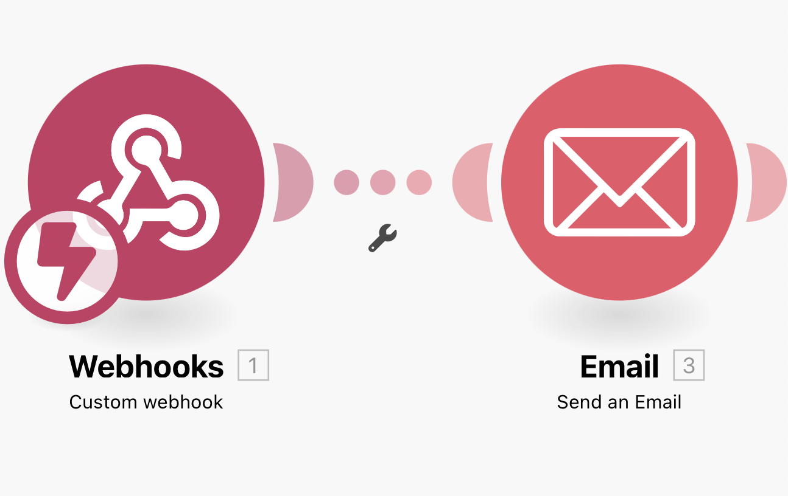

    

# Team-Victorinox

## Members

- Alberto Wicker
- John Arellano
- Dominic Richner

## Introduction

Health-Related Quality of Life (HRQL) reports are a specific type of Patient Reported Outcomes (PRO) that provide essential information beyond the efficacy and safety evaluation of medicinal products. They offer insights into how a drug impacts a patient's daily life and, in certain cases, contribute to the approval process and inclusion in the product's labeling. These aspects of health, directly reported by patients, cover areas that symptoms or clinical measurements may not fully capture. Such evaluations are essential to understanding which outcomes of a drug matter most to patients, particularly in terms of their physical condition associated with the disease. It's important that HRQL instruments are validated for the specific medical condition before being used in any phase of clinical trials. Ultimately, HRQL data can significantly influence drug development by providing a patient-centric perspective on the benefits or disadvantages of a medication.

### Reference

- European Medicines Agency. (2005). Reflection paper on the regulatory guidance for the use of health-related quality of life (HRQL) measures in the evaluation of medicinal products. Retrieved from [https://www.ema.europa.eu/en/documents/scientific-guideline/reflection-paper-regulatory-guidance-use-health-related-quality-life-hrql-measures-evaluation_en.pdf](https://www.ema.europa.eu/en/documents/scientific-guideline/reflection-paper-regulatory-guidance-use-health-related-quality-life-hrql-measures-evaluation_en.pdf)

## Goal

Our objective is to seamlessly integrate Patient Reported Outcomes into our digital pharmacy, aptly named 'PRO Pharmacy.' This process is outlined broadly in this section and involves 3 key steps:

- Prescription Handling: Managed by the patient's physician, involving the integration of sending ePrescriptions via email to all involved parties upon submission of the prescription form.
- Patient Identification: Distinguish patients enrolled in the PRO program and requesting them to fill out the PRO form via email.
- Data Analysis and Reporting: Utilizing data from both the ePrescription database and the PRO database to generate weekly reports, which are then shared with our partners (pharmaceutical companies).

For this project, we've chosen to focus on Phase IV (post-marketing) to monitor long-term impacts on quality of life in a real-world setting across a broader patient population. Our focus is on patients diagnosed with migraine (encompased in ICD-10: G43), as HRQL reports are particularly significant in chronic diseases. The PRO form used in our project is based on the "Migraine Specific Quality of Life" (MSQOL), a validated instrument, which has been simplified for this project. The insights gained from these reports will ultimately help pharmaceutical companies tailor drugs to meet previously unidentified patient needs, redefine marketing strategies, distinguish their drugs from competitors, and potentially influence the design of clinical trials.

## Overview

ADD A COMPREHENSIVE TEXT DESCRIBING PROCCESS 1 AND PROCCESS 2

## Process 1 

The process starts with a google form which is filled out by the doctore with information on the doctor, patient, the perscription and PRO and furthermore a QR Code is generated and sent via email. 

In the make scenario the google sheet ePrescription Form (Responses) is watched for new rows. Furthermore a request via the HTTP POST method is made with a json request content (): 

{
"variables":{

"timestamp":{
"value":"{{4.`0`}}",
"type":"String"},

"doctorEmail":{
"value":"{{4.`1`}}",
"type":"String"},

"medLicenseNr":{
"value":"{{4.`3`}}",
"type":"String"},

"physician":{
"value":"{{4.`2`}}",
"type":"String"},

"patientName":{
"value":"{{4.`4`}}",
"type":"String"},

"dateOfBirth":{
"value":"{{4.`5`}}",
"type":"String"},

"healthInsuranceDetails":{
"value":"{{4.`6`}}",
"type":"String"},

"dateOfPrescription":{
"value":"{{4.`7`}}",
"type":"String"},

"medicationPrescribed":{
"value":"{{4.`8`}}",
"type":"String"},

"quantityToDispense":{
"value":"{{4.`9`}}",
"type":"String"},

"directionsForUse":{
"value":"{{4.`10`}}",
"type":"String"},

"diagnosisICD10":{
"value":"{{4.`11`}}",
"type":"String"},

"descriptionOfDiagnosis":{
"value":"{{4.`12`}}",
"type":"String"},

"allergiesAndMedInteractions":{
"value":"{{4.`13`}}",
"type":"String"},

"patientEmail":{
"value":"{{4.`14`}}",
"type":"String"},

"enrollment":{
"value":"{{4.`15`}}",
"type":"String"}

}
}

In camunda the form ids are defined and used in the aforementioned json and the corresponding value is selected in make. The gate checks the condition verfy equals true or false, this is processed by a user task and is followed by the user taks dispense medication.

The make scenario with the weebhok and send email modules are scheduled for immediate (as soon as data arrives) and therefore does not need to be run immediately. A medication dispensation email will be sent from teamvictorinoxoutlook.com account with the follwoing text:
<<Dear Customer, the medication you orderd has been dispensed. Thank you for choosing our pharmacy. Your Victorinox team.
>>

To Do: add a further service task for the email to be send to people with PRO enrollment (with the form) after the second gate. Further make scenario with schedule immediate.

## Process 2 (Analysis and Report Generation)

### BPMN description

