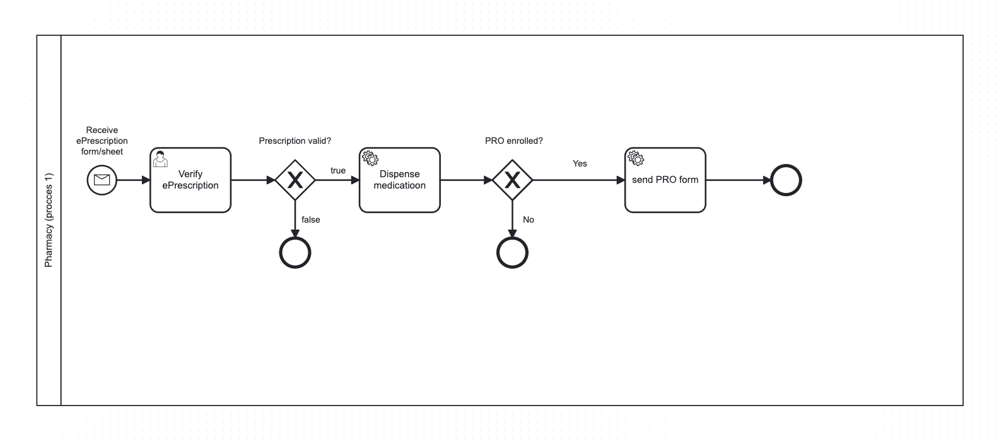
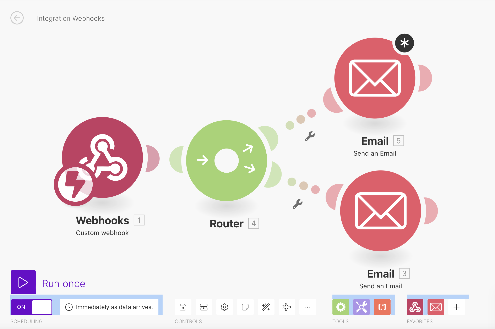

    

## 
 Master of Science in Medical Informatics: Digitization of Business Processes in Healthcare (Autumn-2023) 

**Team Name**: Victorinox

**Topic**: Digital Pharmacy

**Product Name**: PRO Pharmacy

**Deliverables**: 
1) GitHub repositories with modeling and technical artefacts as well as the supporting documentation.
2) Links to a running workflows and microservice instantiations.
3) A PowerPoint presentation.

**Presentation Date**: December 7th, 2023 @ 1600

#### Members

| **Names**         | **Emails**                          |
|-------------------|-------------------------------------|
| Alberto Wicker    | alberto.wickervera@students.fhnw.ch |
| John Arellano     | john.arellano@students.fhnw.ch      |
| Dominic Richner   | dominic.richner@students.fhnw.ch    |

## 
 Introduction 

**Health-Related Quality of Life (HRQL)** reports are a type of Patient Reported Outcomes (PRO) that provide valuable information beyond the efficacy and safety of medicinal products. They offer insights into how a drug impacts a patient's daily life and, in some cases, contribute to the approval process / inclusion of the product's labeling. These aspects of health, directly reported by patients, cover areas that symptoms or clinical measurements often fail to fully capture. Such evaluations are essential to understand which outcomes of a drug matter most to patients by providing a patient-centric perspective on the advantages and disadvantages of a particular medication. It's important that HRQL instruments are validated for a medical condition before being used in any phase of clinical trials.

### 
 Reference

- European Medicines Agency. (2005). Reflection paper on the regulatory guidance for the use of health-related quality of life (HRQL) measures in the evaluation of medicinal products. Retrieved from [https://www.ema.europa.eu/en/documents/scientific-guideline/reflection-paper-regulatory-guidance-use-health-related-quality-life-hrql-measures-evaluation_en.pdf](https://www.ema.europa.eu/en/documents/scientific-guideline/reflection-paper-regulatory-guidance-use-health-related-quality-life-hrql-measures-evaluation_en.pdf)

## 
 Goal

Our objective is to seamlessly integrate Patient Reported Outcomes into our digital pharmacy, aptly named 'PRO Pharmacy.' This process is outlined broadly in this section and involves 3 key steps:

- **Prescription Handling:** Managed by the patient's physician, involving the integration of sending ePrescriptions via email to all involved parties upon submission of the prescription form.
- **Patient Identification:** Distinguish patients enrolled in the PRO program and requesting them to fill out the PRO form via email.
- **Data Analysis and Reporting:** Utilizing data from both the ePrescription database and the PRO database to generate weekly reports, which are then shared with our partners (pharmaceutical companies).

For this project, we've chosen to focus on Phase IV (post-marketing) to monitor long-term impacts on quality of life in a real-world setting across a broader patient population. Our focus is on patients diagnosed with migraine (encompased in ICD-10: G43), as HRQL reports are particularly significant in chronic diseases. The PRO form used in our project is based on the "Migraine Specific Quality of Life" (MSQOL), a validated instrument, which has been simplified for this project. The insights gained from these reports will ultimately help pharmaceutical companies tailor drugs to meet previously unidentified patient needs, redefine marketing strategies, distinguish their drugs from competitors, and potentially influence the design of clinical trials.

## 
 Overview 

🔴 BACKBONE: ADD A COMPREHENSIVE TEXT DESCRIBING PROCCESS 1 AND PROCCESS 2, FORMS, GOOGLE SHEETS AND APPS SCRIPT (JAVAS) (✅)🔴

### Apps Scripts
### ePrescription (Doc, QR, Emails)
**Triggered upon form submission**. Creates a Google Doc for each ePrescription Form submission, it includes relevant details for the patient's prescription. The document is shared via a URL to generate a QR code. This QR code contains the prescription Document, and  is emailed to the patient, physician, and a PRO Pharmacy. Finally, the QR code is inserted into the ePrescription Form (Responses) Sheet for record-keeping. The final step is a cleanup process where the prescription document is sent to the trash and expires on 30 days.
- link: https://script.google.com/u/0/home/projects/1VzjttMBquePwKhkX1ZhEvc_Y6TTLFy3YXdQ3eRqG2LVxo7UGkxsF99BK/edit

### ePRO  (colab VIZ script)
**Triggered by form submissions**, adds longitude and latitude to column 14 and 15 respectively  to the ePRO (Responses) Sheet. For each form submission, it combines street, zip, and city to obtain latitude and longitude, which are then added to the respective columns in the sheet. The script manages  addresses in Switzerland and handles errors when the script does not return a result.
- link: https://script.google.com/u/0/home/projects/1YEapO_Fc2_eZS1A2NrFAhlawmzkorGyFHZmKq-hdlaPc2TExKN3PMHVY/edit

## 
 Process 1  

The process starts with a google form which is filled out by the doctor with information on the doctor, patient, the perscription and PRO enrollment and furthermore a QR Code is generated and sent via email. 

    

In the make scenario the google sheet ePrescription Form (Responses) is watched for new rows. Furthermore a request via the HTTP POST method is made with a json request content (): 

{
"variables":{

"timestamp":{
"value":"{{4.`0`}}",
"type":"String"},

"doctorEmail":{
"value":"{{4.`1`}}",
"type":"String"},

"medLicenseNr":{
"value":"{{4.`3`}}",
"type":"String"},

"physician":{
"value":"{{4.`2`}}",
"type":"String"},

"patientName":{
"value":"{{4.`4`}}",
"type":"String"},

"dateOfBirth":{
"value":"{{4.`5`}}",
"type":"String"},

"healthInsuranceDetails":{
"value":"{{4.`6`}}",
"type":"String"},

"dateOfPrescription":{
"value":"{{4.`7`}}",
"type":"String"},

"medicationPrescribed":{
"value":"{{4.`8`}}",
"type":"String"},

"quantityToDispense":{
"value":"{{4.`9`}}",
"type":"String"},

"directionsForUse":{
"value":"{{4.`10`}}",
"type":"String"},

"diagnosisICD10":{
"value":"{{4.`11`}}",
"type":"String"},

"descriptionOfDiagnosis":{
"value":"{{4.`12`}}",
"type":"String"},

"allergiesAndMedInteractions":{
"value":"{{4.`13`}}",
"type":"String"},

"patientEmail":{
"value":"{{4.`14`}}",
"type":"String"},

"enrollment":{
"value":"{{4.`15`}}",
"type":"String"}

}
}

    

In camunda the form ids are defined and used in the aforementioned json and the corresponding value is selected in make. The gate checks the condition verfy equals true or false, this is processed by a user task and is followed by the user taks dispense medication.

    

The make scenario with the weebhok and send email modules are scheduled for immediate (as soon as data arrives) and therefore does not need to be run immediately. A medication dispensation email will be sent from teamvictorinoxoutlook.com account with the follwoing text:
<<Dear Customer, the medication you orderd has been dispensed. Thank you for choosing our pharmacy. Your Victorinox team.
>>

An email is sent to people with PRO enrollment conaining a link to the form. The router determines which service task is calling and routes to the corresponding email sending module.

1. deploy camunda model
2. doctor fills out the patient form
3. run scanrio 1 (google sheets) -> HTTP POST method API call sends a json object to camunda
   a)Task list
   b)satrt process
   c)chose process
   d)start
a)-d) is done automatically

the form then needs to be claimed and the veryfy check box needs to be selected by the pharmacy employee manually.

## 
 Process 2: Analysis and Report Generation 

### First Element: Timer Start Event (Weekly Report)
The process begins with a Timer Start Event set in the BPMN diagram (Camunda Platform 7). This timer, configured as a "Duration" type, initiates the process every 10 seconds for demonstration. Ideally, in real-life applications, this process would start weekly, every Monday morning, to generate the report.

🔴--- *insert image of Timer Start Event here*🔴

### Second Element: Service Task (Generate and send report to senior)
The primary objective of this task is to generate a PDF report, which is then dispatched to our partners. It involves two connector inputs: the first with an assignment type of "String or Expression" and a value of GET, and the second, also a "String or Expression," containing the tunneling link for our PRO Pharmacy REST API (Python Flask) developed in Deepnote.

🔴--- *insert image of Service Task here*🔴

### PRO Pharmacy REST API (Python Flask)

🔴--- *insert image of Deepnote logo here*🔴

The REST API developed in Deepnote's Python environment is designed to analyze ePrescription and ePRO data from Google Sheets, focusing on migraine medication prescriptions and patient quality of life metrics. 

**Key Features:**

- **Flask Web Application Setup**: A Flask app is established to serve as the interface of the system.
- **Data Loading from Google Sheets**: The code accesses our databases (ePrescription and ePRO Responses) using Gspread and OAuth2Client with a JSON file (API key credential) generated in Google Cloud Platform.
- **Data Analysis**: This involves creating visualizations, which are then saved as PNG files. These visualizations include Daily Prescriptions (line plot), Prescriptions per Medication (bar chart), Age Distribution of Patients (histogram), Improvements in Migraines (histogram), and Geographical Distribution (bar chart) and a map of Switzerland (using longitude and latitude from the ePRO Responses dataset and .shp/.shx  images downloaded from DIVA-GIS https://diva-gis.org/gdata).
- **Report Generation using FPDF**: All saved PNG visualizations are compiled into a PDF. The title of the report is customized using datetime, and graphs are displayed over two pages.
- **Email Functionality with SendGrid (Cloud-Based Email Service)**: An API key is generated using SendGrid, enabling the sending of personalized emails with the attached PDF report for review by a senior at PRO Pharmacy before forwarding to our partners.

**The notebook is configured to run as a server using Flask, making the application accessible over the web.**

**Notebook Access**: [PRO Pharmacy REST API Notebook in Deepnote](https://deepnote.com/workspace/datalbert-6d30db34-a25b-4c27-beda-e66b05ce5c6a/project/Exercise-Writing-your-own-REST-API-using-Python-Flask-Duplicate-3a9b6dfd-68f9-4978-801c-90337e531605/notebook/PRO%20(Flask)-89ce43eca8674262ba69378311b017b9)

### Third Element: User Task (Report validation by senior)
This step is designated as a User Task because it requires a review by a senior member at PRO Pharmacy. The email generated in the previous Service Task, with the attached PDF report, is reviewed by a senior member who may add additional remarks before dispatching it to our partners.

🔴--- *insert image of User Task here*🔴
🔴--- *insert image of Generated email with attachment here*🔴

### Fourth Element: Message End Event

🔴--- *insert image of Message End Event here*🔴

The process concludes with the sending of the email to our pharmaceutical partners, marking the end of the second process.

## 
 Acknowledgments 

Special thanks to Charuta Pande for her invaluable guidance and patience throughout this project. Her expertise was crucial in meticulously shaping and refining our project vision.

We also extend our gratitude to Andreas Martin for providing us with the essential tools necessary to advance our project. His support played a significant role in our progress and success.

